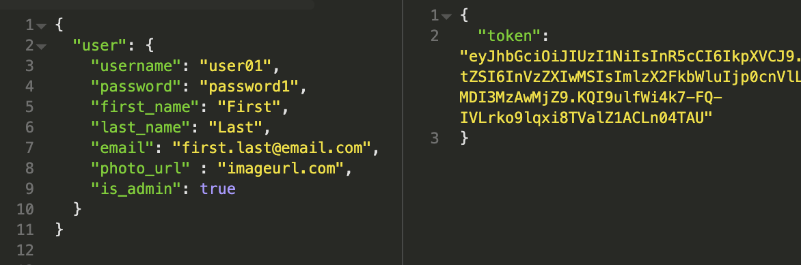
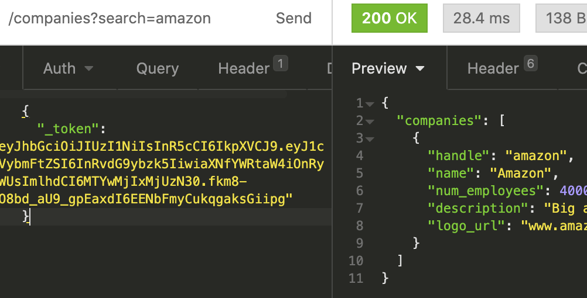

# Jobly Back End 
JSON API application using NodeJS/Express with resources on companies and jobs. This application uses:
- NodeJS/Express
- PostgreSQL
- Jest supertest

# How to use API
In root directory, run the following command: node server.js As with other RESTful APIs, it's helpful to use a platform like Insomnia to see test how the application responds to different requests.

The company and job routes require user authentication. When you login or sign up, the app will return a token which you can then send along with your other requests.

Sample signup route:

Get companies route with authentication:  Note that application depends the value of token to be stored in key _token.

# Project Screen Shots

# Routes
## Companies
<ul>
<li>GET /companies: returns list of all companies. This route also accepts the following query parameters to filter results: search, min_employees and max_employees For example, the following get request can expect a resource of all companies with the word apple somewhere in the name and and that have at least 2000 employees. 
baseurl/companies?search=apple&min_employees=2000</li>

<li>POST /companies: Adds a new company to database. Requires admin authorization.</li>

<li>GET /companies/<handle> with handle being the company handle will receive a resource on all details for that company.</li>

<li>UPDATE/DELETE /companies/<handle>: requests can be made to a specific company where the handle is the company's handle. This route requires admin authorization.</li>
</ul>

## Jobs
<ul>
<li>GET /jobs: returns list of all jobs in database. This route also accepts the following query params: search, min_salary and max_salary</li>
<li>POST /jobs: Adds a new job to database. Requires admin authorization.</li>
<li>GET /jobs/<id> with id being the job id will receive a resource on all details for that id.</li>
<li>UPDATE/DELETE job/<id> update and delete requests can be made to a specific job where the id is the job id. This route requires admin authorization.</li>
</ul>

# Testing
In root directory, run the following command: jest

